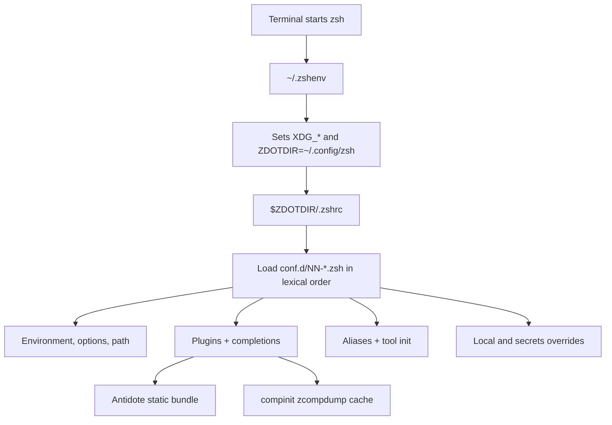
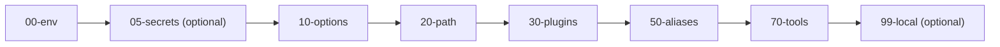
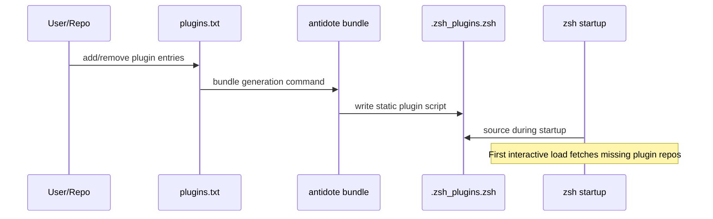
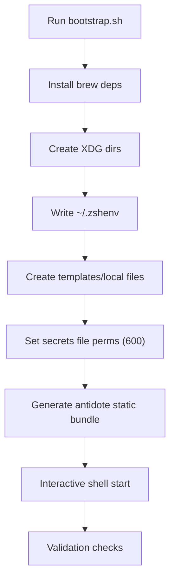

# ZSH Dotfile Setup (by mal_h)

This repository defines my zsh setup for macOS that is:

- XDG-aligned (`ZDOTDIR` under `~/.config`)
- deterministic (numbered module loading)
- fast (static plugin bundle + cached completion dump)
- maintainable (few files, clear boundaries)

It is designed to support:

- Antidote for zsh plugins (static loading model)
- Starship prompt
- Neovim as default editor

## Installation / Setup

From this repository root:

```sh
chmod +x ./bootstrap.sh
./bootstrap.sh
```

What this does:

1. installs Homebrew (if missing)
2. installs required packages (`antidote`, `starship`, `neovim`, `zsh-completions`, `fzf`)
3. creates a timestamped backup of existing zsh config (if present)
4. creates XDG directories
5. writes `~/.zshenv` from `.zshenv.example`
6. installs config into `~/.config/zsh`
7. creates local files if missing:
   - `~/.config/zsh/conf.d/05-secrets.zsh`
   - `~/.config/zsh/conf.d/99-local.zsh`
8. sets secure permissions on secrets file
9. generates Antidote static bundle
10. writes a merge suggestion report based on prior config
11. runs syntax validation

After install:

```sh
exec zsh -l
```

Then verify:

```sh
echo "$ZDOTDIR"
echo "$EDITOR"
echo "$HISTFILE"
```

Backup and merge notes:

- Backups are stored under `~/.local/state/zsh/bootstrap-backups/<timestamp>/`
- Bootstrap prints the exact backup path and merge report path on completion
- Merge report file: `merge-suggestions.md`
- Use it to migrate prior exports/options/aliases/functions into the new `conf.d/` modules

## Publish to GitHub

If this directory is not yet a git repo:

```sh
git init
git add .
git commit -m "Initial zsh dotfiles setup"
```

Create a GitHub repo and push:

```sh
gh repo create <your-user>/<your-repo> --private --source . --remote origin --push
```

If you do not use `gh`, create the repo in GitHub UI and then:

```sh
git remote add origin git@github.com:<your-user>/<your-repo>.git
git branch -M main
git push -u origin main
```

## One-Line Remote Install

This repo includes `install.sh` for a curl-based install.

```sh
curl -fsSL https://raw.githubusercontent.com/<your-user>/<your-repo>/main/install.sh | REPO_URL=https://github.com/<your-user>/<your-repo>.git bash
```

Optional overrides:

- `BRANCH=<branch-name>`
- `TARGET_DIR=<clone-path>`

Example:

```sh
curl -fsSL https://raw.githubusercontent.com/<your-user>/<your-repo>/main/install.sh | REPO_URL=https://github.com/<your-user>/<your-repo>.git BRANCH=main TARGET_DIR=$HOME/.local/src/zsh-dotfiles bash
```

## Goals and Constraints

- macOS only (Apple Silicon first, Intel supported)
- one required zsh file in `$HOME`: `~/.zshenv`
- configuration in `~/.config/zsh`
- state and cache outside config:
  - history in `~/.local/state/zsh`
  - completion dump in `~/.cache/zsh`
- avoid over-modularization; split files only when order or size justifies it

## High-Level Architecture



## Directory Layout

```text
~/.config/zsh/
├── .zshrc
├── .zprofile
├── .zlogin
├── .zlogout
├── conf.d/
│   ├── 00-env.zsh
│   ├── 05-secrets.zsh            # untracked, chmod 600
│   ├── 05-secrets.example.zsh    # tracked template
│   ├── 10-options.zsh
│   ├── 20-path.zsh
│   ├── 30-plugins.zsh
│   ├── 50-aliases.zsh
│   ├── 70-tools.zsh
│   ├── 99-local.zsh              # untracked
│   └── 99-local.example.zsh      # tracked template
├── antidote/
│   ├── plugins.txt
│   └── .zsh_plugins.zsh          # generated, gitignored
└── starship/
    └── starship.toml
```

Related XDG paths:

- `~/.cache/zsh/zcompdump-$ZSH_VERSION`
- `~/.local/state/zsh/history`

## Startup File Ownership

Only `~/.zshenv` is required in `$HOME` for zsh to find `ZDOTDIR`.
This repo tracks `.zshenv.example`; `bootstrap.sh` copies it to `~/.zshenv`.

Example `~/.zshenv`:

```zsh
export XDG_CONFIG_HOME="${XDG_CONFIG_HOME:-$HOME/.config}"
export XDG_CACHE_HOME="${XDG_CACHE_HOME:-$HOME/.cache}"
export XDG_DATA_HOME="${XDG_DATA_HOME:-$HOME/.local/share}"
export XDG_STATE_HOME="${XDG_STATE_HOME:-$HOME/.local/state}"
export ZDOTDIR="$XDG_CONFIG_HOME/zsh"
```

Important: third-party installers may still write directly to `~/.zprofile`.  
That does not mean zsh is misconfigured; it means the installer bypassed zsh startup semantics. Move managed content back into `$ZDOTDIR/.zprofile`.

## Load Sequence and Module Contract

`$ZDOTDIR/.zshrc` should be a loader only:

```zsh
[[ -o interactive ]] || return

if [[ -n "$DEBUG_ZSH" ]]; then
  zmodload zsh/zprof
fi

for conf in "$ZDOTDIR/conf.d/"*.zsh(.N); do
  source "$conf"
done
unset conf

if [[ -n "$DEBUG_ZSH" ]]; then
  zprof
fi
```

Module ordering:



Each module has one responsibility:

- `00-env.zsh`: editor, locale baseline (`LANG`), `HISTFILE`, `STARSHIP_CONFIG`
- `10-options.zsh`: shell options and history behavior
- `20-path.zsh`: Homebrew `shellenv`, `path` and `fpath` construction, dedupe
- `30-plugins.zsh`: Antidote static plugin loading + `compinit`
- `50-aliases.zsh`: aliases and small helper functions
- `70-tools.zsh`: external tool init calls
- `99-local.zsh`: machine-specific overrides

## Antidote Design (Static Bundle)

The plugin list is source of truth:

- `~/.config/zsh/antidote/plugins.txt`

Generated output:

- `~/.config/zsh/antidote/.zsh_plugins.zsh` (gitignored)

Flow:



Recommended baseline plugin list:

```text
zsh-users/zsh-autosuggestions
zsh-users/zsh-completions
zsh-users/zsh-history-substring-search
```

Regenerate static bundle when `plugins.txt` changes:

```sh
antidote bundle < "$ZDOTDIR/antidote/plugins.txt" > "$ZDOTDIR/antidote/.zsh_plugins.zsh"
```

## Completion Strategy

Completion flow:

1. Ensure completion directories are in `fpath` (from `20-path.zsh` and plugins)
2. Run `compinit` in `30-plugins.zsh`
3. Cache zcompdump under `~/.cache/zsh`

Recommended default:

```zsh
autoload -Uz compinit
compinit -d "$XDG_CACHE_HOME/zsh/zcompdump-$ZSH_VERSION"
```

Optional speed mode:

```zsh
autoload -Uz compinit
compinit -C -d "$XDG_CACHE_HOME/zsh/zcompdump-$ZSH_VERSION"
```

Use `-C` only if you accept skipping security checks at startup.  
After changing completion sources, run a full `compinit` once (without `-C`).

Install completion sources with Homebrew:

- `brew install zsh-completions`
- `brew install fzf`
- optional command-specific packages (`gh`, `kubectl`, etc.)

For `fzf` completion/keybindings without editing rc files:

```sh
"$(brew --prefix)/opt/fzf/install" --no-bash --no-fish --key-bindings --completion --no-update-rc
```

## Starship and Neovim

Starship:

- set in `00-env.zsh`: `export STARSHIP_CONFIG="$ZDOTDIR/starship/starship.toml"`
- init in `70-tools.zsh`:

```zsh
if (( $+commands[starship] )); then
  eval "$(starship init zsh)"
fi
```

Neovim:

- set editor in `00-env.zsh`
- alias in `50-aliases.zsh`: `alias vim='nvim'`

## Bootstrap (Idempotent)

A bootstrap script should be safe to run repeatedly. It should:

1. install Homebrew if missing
2. install required packages (`antidote`, `starship`, `neovim`, `zsh-completions`, `fzf`)
3. create XDG directories
4. write/update `~/.zshenv`
5. ensure `$ZDOTDIR` files and module templates exist
6. create local copies from templates if absent:
   - `05-secrets.example.zsh -> 05-secrets.zsh`
   - `99-local.example.zsh -> 99-local.zsh`
7. set `chmod 600` on `05-secrets.zsh`
8. generate Antidote static bundle
9. start one interactive shell to materialize missing plugin repos
10. run syntax/startup validation checks

Bootstrap flow:



## Git Hygiene

Use `.gitignore` entries:

```gitignore
conf.d/05-secrets.zsh
conf.d/99-local.zsh
antidote/.zsh_plugins.zsh
**/zcompdump*
```

Do not commit:

- secrets/tokens/API keys
- machine-specific aliases or paths
- generated plugin or completion cache files

## Performance and Profiling

Run full loader profiling:

```sh
DEBUG_ZSH=1 zsh -i -c exit
```

Benchmark startup:

```sh
time zsh -i -c exit
```

Targets:

- warm-cache goal: under 100ms
- investigate regressions above about 200ms

If slow:

1. review `zprof` for top functions/modules
2. reduce plugin count
3. move expensive inits to on-demand wrappers
4. verify Homebrew and completion paths are not duplicated

## Validation Checklist

Syntax:

```sh
zsh -n "$ZDOTDIR/.zshrc" "$ZDOTDIR/conf.d/"*.zsh
```

Correctness (new terminal):

- `echo $ZDOTDIR` prints `~/.config/zsh` path
- `echo $EDITOR` prints `nvim` (or fallback)
- `echo $HISTFILE` points to `~/.local/state/zsh/history`
- `type antidote` and `type starship` succeed if installed
- plugin behavior is active (for example autosuggestions)
- completions work for common commands

Home cleanliness:

- zsh-managed file in `$HOME`: `~/.zshenv`
- if an installer wrote `~/.zprofile`, migrate desired content to `$ZDOTDIR/.zprofile`

## Troubleshooting

`antidote: command not found`:

- verify package install: `brew install antidote`
- ensure plugin module guards for missing command

No completions:

- verify `autoload -Uz compinit` and `compinit` run
- inspect `fpath` ordering
- remove stale dump: `rm -f "$XDG_CACHE_HOME/zsh"/zcompdump*`
- run one full `compinit` (without `-C`)

Slow startup after adding plugins:

- run `DEBUG_ZSH=1 zsh -i -c exit`
- remove or replace slow plugins

Unexpected `~/.zprofile` created:

- keep `~/.zshenv` authoritative for `ZDOTDIR`
- move managed login-shell lines into `$ZDOTDIR/.zprofile`

## Design Rules (When Extending)

1. Add a new module only when order matters or file size justifies it.
2. Keep `.zshrc` as dispatcher only.
3. Keep generated/state files out of git.
4. Prefer static plugin loading over runtime plugin manager logic.
5. Measure startup before and after any change.
